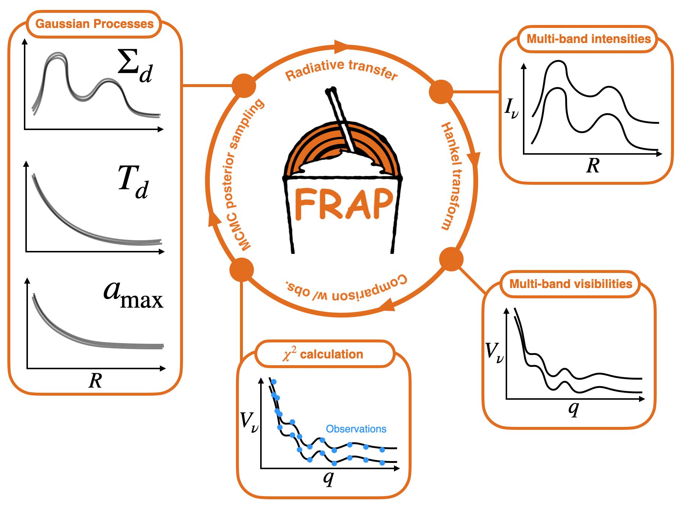

# Flexible Radial Analysis of Protoplanetary disks: FRAP



Do you have observational data of the dust continuum emission from a protoplanetary disk? Flexible Radial Analysis of Protoplanetary disks (FRAP) provides an easy-to-use tool to retrieve dust properties, such as the dust surface density distribution, in disks.

See our [documentation](https://frap.readthedocs.io/en/latest/index.html) for details!

## Installation

If you use [uv](https://docs.astral.sh/uv/) for the package manager:

```
uv add git+https://github.com/tomyoshida/frap.git
```

or you can use pip:

```
pip install git+https://github.com/tomyoshida/frap.git
```

We'll upload the code to PyPI soon!


## Citation

Available soon!


